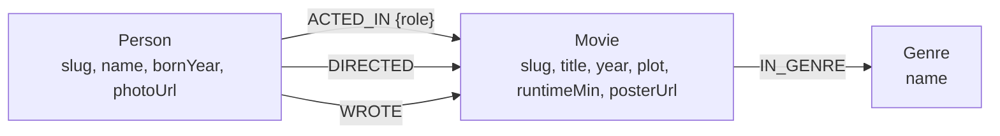
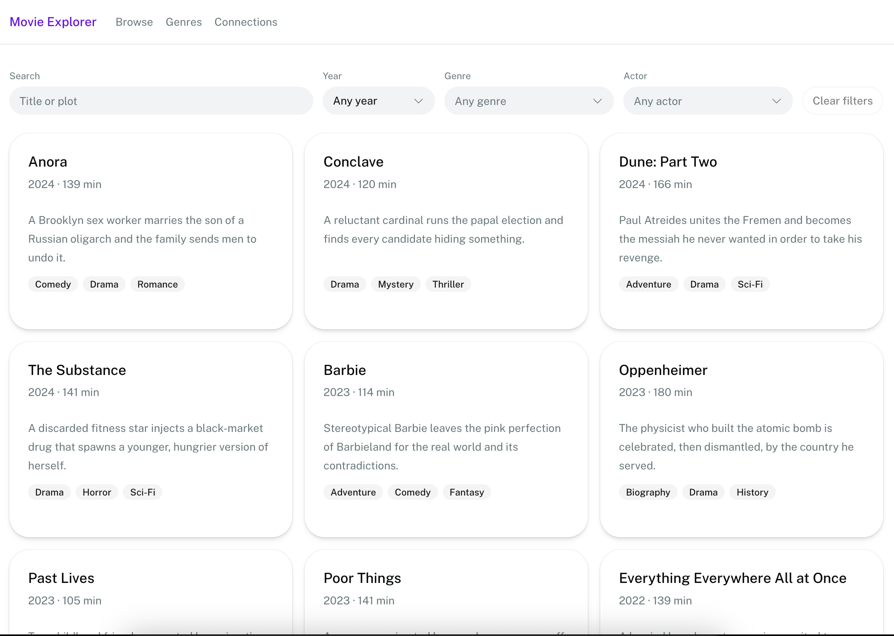
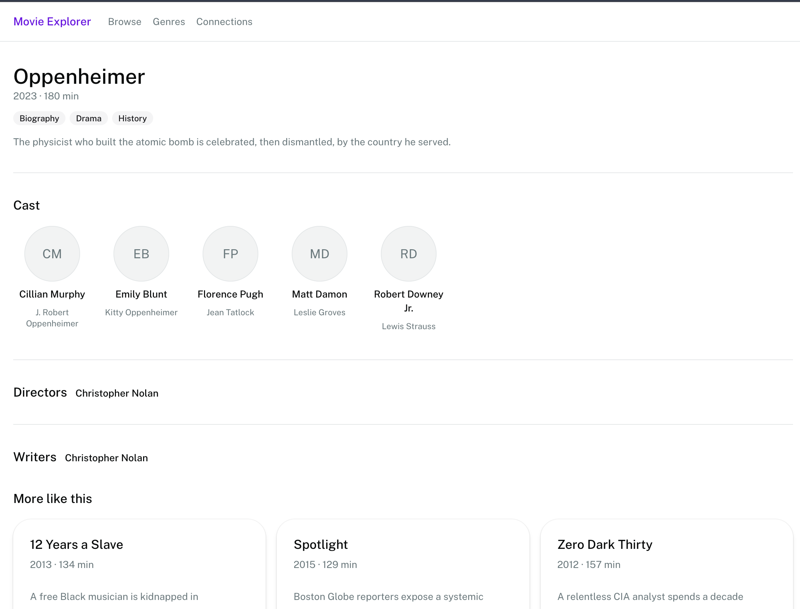
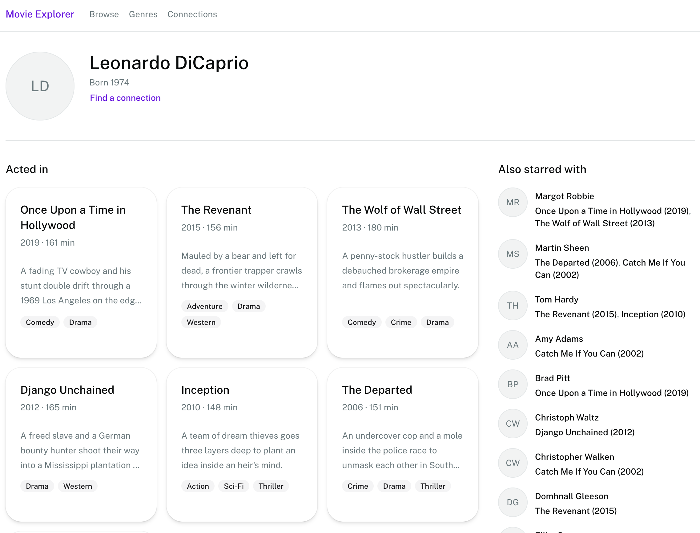
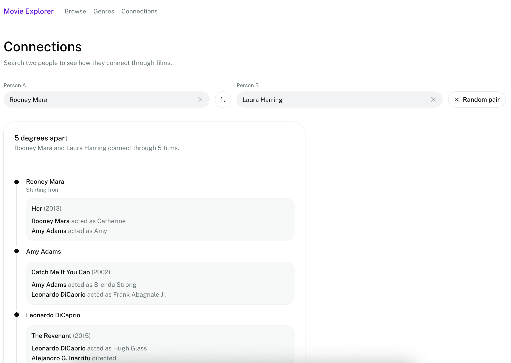

# Movie Explorer

Browse movies, people, and genres. The main feature is **Connections**: pick two people and see the shortest chain of films that links them.

- **Browse** — search films by title, year, genre, or actor.
- **Movie** — cast, directors, writers, and similar films.
- **Person** — the films they worked on, and who they starred with.
- **Connections** — how two people connect through films. You can also pick a random pair.

The seed data has 100 movies, 544 people, and 19 genres.

## Why a graph database?

This app is about **links** between people and films, not just lists of rows.

You could store the same data in tables (movies, people, and join tables for acting, directing, and writing). That works for “show me this movie.” It gets messy for the questions this app actually asks:

- **How are two people connected?** You have to walk through films they both worked on, then through the next person, and so on, until you find the shortest chain. In SQL that means recursive queries across three different credit tables. In a graph it is one `shortestPath` query.
- **Who starred with this person the most?** Walk two steps: person → movie → other person. Same idea for “movies like this one”: movie → genre → other movie.
- **Acting, directing, and writing are different kinds of links.** A graph can follow all three in one walk. SQL would have to union those tables and recurse over the mix.

A graph database fits because the product is the connections, not a spreadsheet of movies.

## Data model



`Movie.slug`, `Person.slug`, and `Genre.name` are unique. Seed files are in `cognodb/seed/movie-data/`. Load them with `bun run db:seed`.

## Screenshots

**Browse**



**Movie**



**Person**



**Connections**



## Main queries

Queries use parameters through the official Neo4j driver (`lib/db.ts`). Cypher is never built by concatenating strings.

**Shortest path between two people** (`people.connection`). Walks acting, directing, and writing links, up to 12 steps. This is the query that would be hard in SQL.

```cypher
MATCH (from:Person {slug: $fromSlug}), (to:Person {slug: $toSlug})
MATCH path = shortestPath(
  (from)-[:ACTED_IN|DIRECTED|WROTE*1..12]-(to)
)
RETURN
  [n IN nodes(path) | CASE
    WHEN n:Person THEN n { kind: 'person', .slug, .name, .bornYear, .photoUrl }
    WHEN n:Movie THEN n { kind: 'movie', .slug, .title, .year, .plot, .runtimeMin, .posterUrl }
  END] AS nodes,
  [r IN relationships(path) | { type: type(r), role: r.role }] AS rels
```

**Co-stars** (`people.costars`). Two hops: person → movie → other person. Sorted by how many films they share.

```cypher
MATCH (a:Person {slug: $slug})-[:ACTED_IN]->(m:Movie)<-[:ACTED_IN]-(other:Person)
WHERE other.slug <> $slug
WITH other, collect(DISTINCT m { .slug, .title, .year, ... }) AS movies
ORDER BY size(movies) DESC, other.name
```

**Similar movies** (`movies.related`). Two hops: movie → genre → other movie. Sorted by how many genres they share.

```cypher
MATCH (m:Movie {slug: $slug})-[:IN_GENRE]->(g:Genre)<-[:IN_GENRE]-(other:Movie)
WHERE other.slug <> $slug
WITH other, count(DISTINCT g) AS shared
ORDER BY shared DESC, other.year DESC
LIMIT 6
```

## Setup

### CognoDB Cloud

1. Sign up at [https://console.cognodb.com/signup](https://console.cognodb.com/signup) (free, no credit card).
2. Create a free **c0** instance and pick a region.
3. Copy the URI (`bolt+s://<instance-id>.databases.cognodb.cloud`), username, and password. The password is shown only once.

### Run locally

You need [Bun](https://bun.sh).

```bash
bun install
cp .env.example .env.local
```

Put this in `.env.local`:

```bash
COGNODB_URI="bolt+s://<instance-id>.databases.cognodb.cloud"
COGNODB_USERNAME="<username>"
COGNODB_PASSWORD="<password>"
```

```bash
bun run db:check
bun run db:seed
bun run dev          # http://localhost:3000
```

To wipe and load again: `bun run db:seed -- --reset`.
